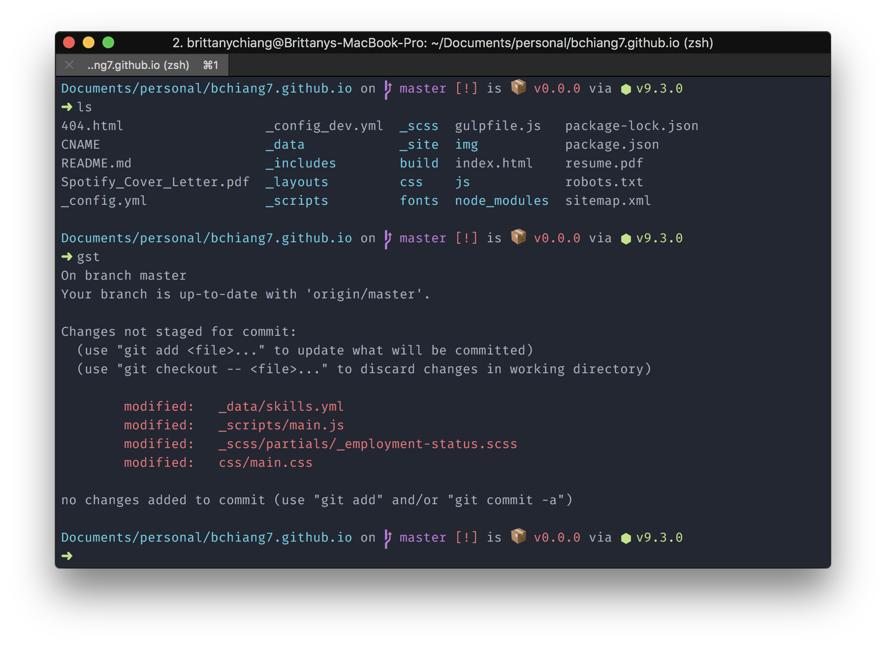
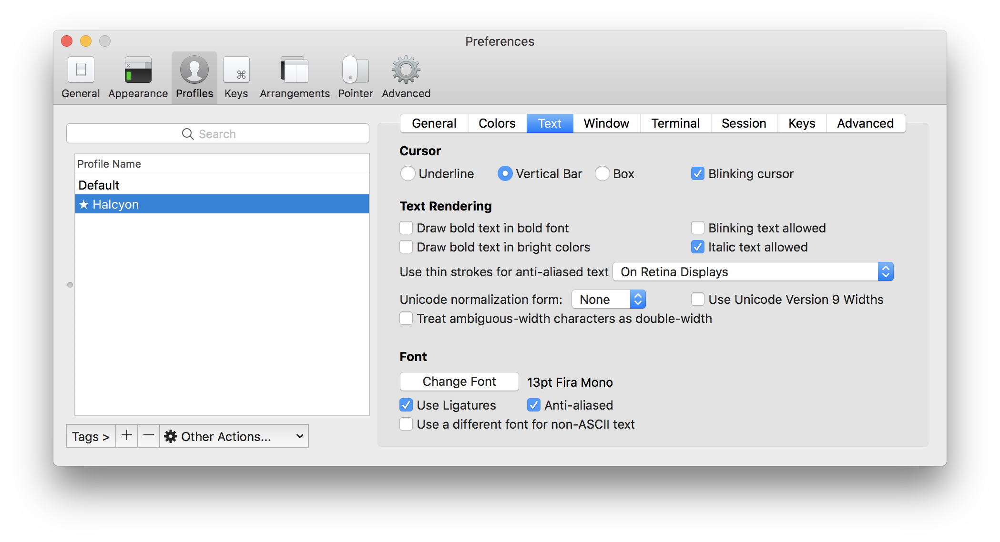

  

<h1 align="center">
  Halcyon Theme for iTerm
</h1>

  A minimal, dark blue theme for VS Code, Sublime Text, Atom, and more.

## Installation

1. Clone this repo
1. In iTerm2 open `Preferences > Profiles`
1. Under the `Colors` tab find `Color Presets > Import`
1. Import the `halcyon.itermcolors` file

## Settings

I'm currently using the [Spaceship Prompt](https://github.com/denysdovhan/spaceship-prompt) for [ZSH](http://zsh.org/)

## Shameless Plug

Halcyon is also available for Sublime Text, VS Code, Hyper, and more! Check out all available options [here](https://halcyon-theme.netlify.com/).
