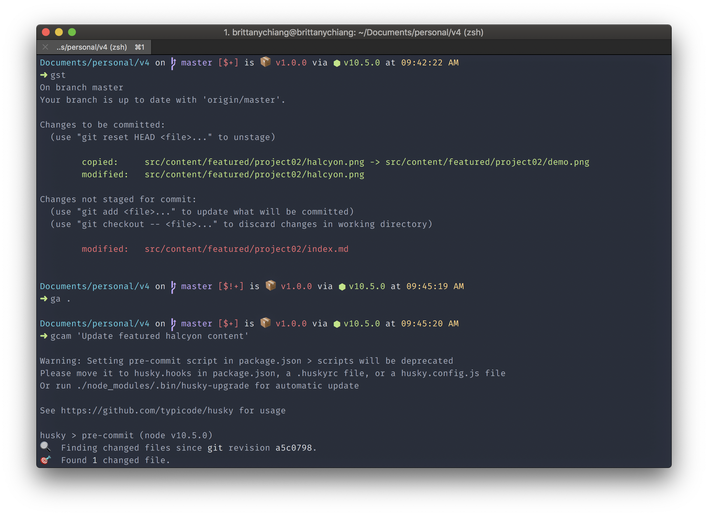

# Halcyon for iTerm

## Installation

1. Clone this repo
1. In iTerm2 open `Preferences > Profiles`
1. Under the `Colors` tab find `Color Presets > Import`
1. Import the `halcyon.itermcolors` file

Here are my settings:

I'm currently using the [Spaceship Prompt](https://github.com/denysdovhan/spaceship-prompt) for [ZSH](http://zsh.org/)
